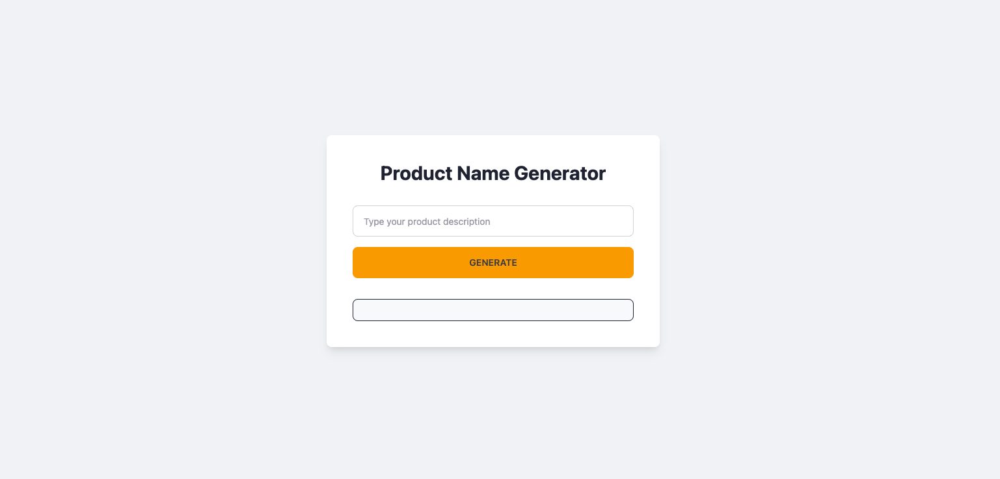

# product-name-generator

## Description
* This project is a simple web application that generates products name using the OpenAI API. The application allows users to input a prompt and receive a list of generated questions in response.

## Installation
* Clone the repository
* Install dependencies by running ```npm install```
* Set up environment variables, create env file and get api key from openai website. 
* ```OPENAI_API_KEY=your_openai_api_key```

## Usage
* Start the server ```npm start```
* Open your browser ```http://localhost:3001```
* Generate product names

## Dependencies
* Express
* Body Parser
* OpenAI
* Dotenv

## Application Page
* 

## Contact Me

* [Github](https://github.com/veyselarslan12)
* Enjoy your AI Product Name Generator
